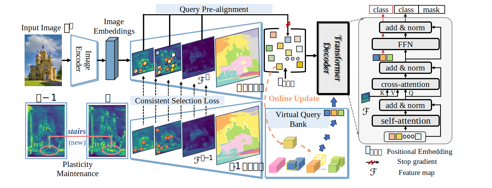

# SimCIS

**Rethinking Query-based Transformer for Continual Image Segmentation.** *(CVPR2025)*

[](LICENSE)[](./assets/CVPR_2025_SimCIS.pdf)


By [Yuchen Zhu*](https://github.com/ZhuYuChenNO1), [Cheng Shi*](https://chengshiest.github.io/),  Dingyou Wang, Jiajin Tang, Zhengxuan Wei, Yu Wu, Guanbin Li and [Sibei Yang†](https://faculty.sist.shanghaitech.edu.cn/yangsibei/)

*Equal contribution; †Corresponding Author

## 📣 News

* [2025.06.09] 🤗 We fully release SimCIS, including both code and [paper](./assets/CVPR_2025_SimCIS.pdf)!
* [2025.03.03] We are preparing the code and camera ready version of our paper!
* [2025.02.27] Our paper is accepted by CVPR2025!


## 📝 To-do list

- [x] Release the code and paper.
- [ ] Release the weights in the next few days.
- [ ] More detailed instructions.


## 💡 Quick Start
### 1. Set up environments

```bash
conda create --name simcis python=3.8 -y
conda activate simcis
conda install pytorch==1.9.0 torchvision==0.10.0 cudatoolkit=11.1 -c pytorch -c nvidia
pip install -U opencv-python

git clone git@github.com:SooLab/SimCIS.git
cd SimCIS

cd detectron2
pip install -e .
pip install git+https://github.com/cocodataset/panopticapi.git
pip install git+https://github.com/mcordts/cityscapesScripts.git
cd ..
pip install -r requirements.txt

```

#### CUDA kernel for MSDeformAttn
After preparing the required environment, run the following command to compile CUDA kernel for MSDeformAttn:

`CUDA_HOME` must be defined and points to the directory of the installed CUDA toolkit.

```bash
cd mask2former/modeling/pixel_decoder/ops
sh make.sh
```

## 2. Data Preparation

We follow the previous work [Balconpas](https://github.com/jinpeng0528/BalConpas/tree/master) to prepare the training data. 

Please download the ADE20K dataset and its instance annotation from [here](http://sceneparsing.csail.mit.edu/), then place the dataset in or create a symbolic link to the `./datasets` directory. The structure of data path should be organized as follows:
```
ADEChallengeData2016/
  images/
  annotations/
  objectInfo150.txt
  sceneCategories.txt
  annotations_instance/
  annotations_detectron2/
  ade20k_panoptic_{train,val}.json
  ade20k_panoptic_{train,val}/
  ade20k_instance_{train,val}.json
```
The directory `annotations_detectron2` is generated by running `python datasets/prepare_ade20k_sem_seg.py`.
Then, run `python datasets/prepare_ade20k_pan_seg.py` to combine semantic and instance annotations for panoptic annotations and run `python datasets/prepare_ade20k_ins_seg.py` to extract instance annotations in COCO format.

To fit the requirements of continual segmentation tasks, run `python continual/prepare_datasets.py` to reorganize the annotations (reorganized annotations will be placed in `./json`).

#### Example data preparation
```bash
# for Mask2Former
cd datasets
wget http://data.csail.mit.edu/places/ADEchallenge/ADEChallengeData2016.zip
unzip ADEChallengeData2016.zip
cd ADEChallengeData2016
wget http://sceneparsing.csail.mit.edu/data/ChallengeData2017/annotations_instance.tar
tar -xvf annotations_instance.tar
cd ../..
python datasets/prepare_ade20k_sem_seg.py
python datasets/prepare_ade20k_pan_seg.py
python datasets/prepare_ade20k_ins_seg.py

# for continual segmentation
python continual/prepare_datasets.py
```

## 🔥 Training 
Please follow the [scripts](./scripts) to train SimCIS!

For example:

```bash
bash scripts/pan_100-5.sh
```

## ⚡️ Evaluation
Please follow the [scripts](./scripts) to evaluate SimCIS!

For example:

```bash
# 11 means the 11th step(last step for 100-5 setting)
bash scripts/panoptic_eval.sh 11
```

## 👍 Acknowledgement and Related Work
* This code is mainly based on [Mask2Former](https://github.com/facebookresearch/Mask2Former). We thank them for their excellent work.
* Related work for continual image segmentation: [Balconpas](https://github.com/jinpeng0528/BalConpas/tree/master), [ECLIPSE](https://github.com/clovaai/ECLIPSE). We appreciate the contributions of these researchers.